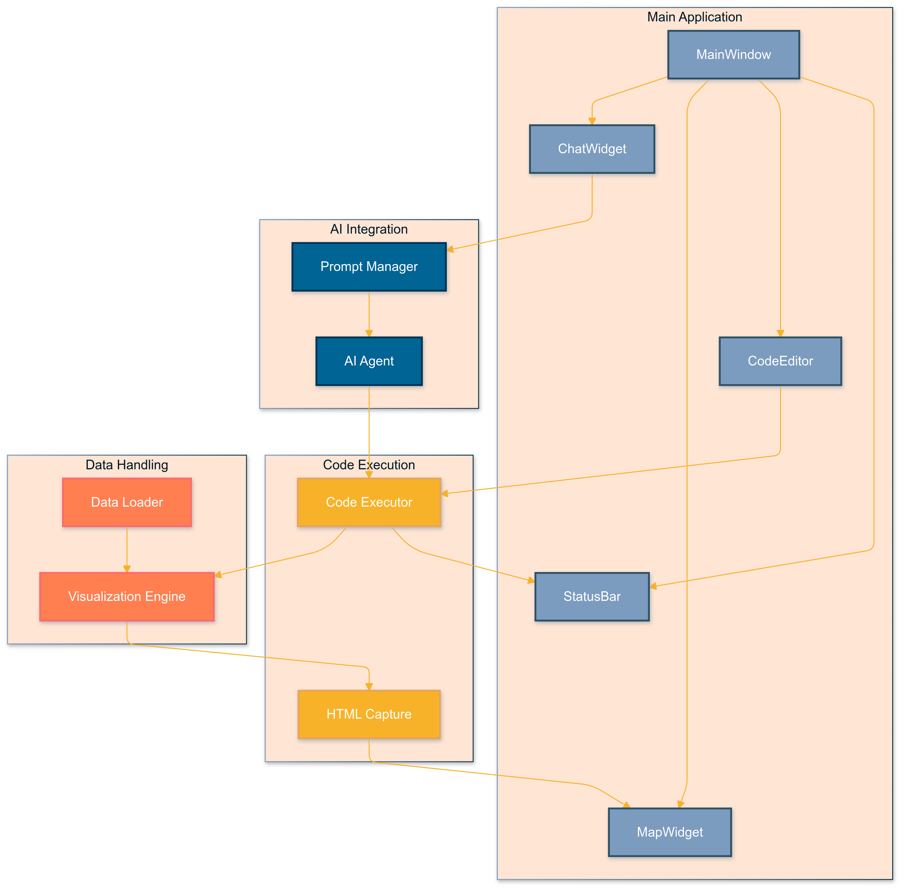
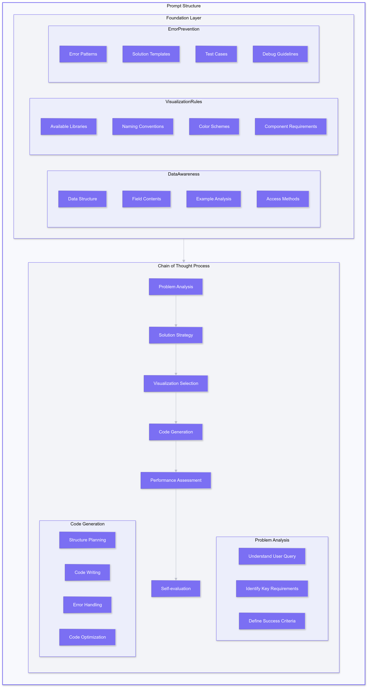
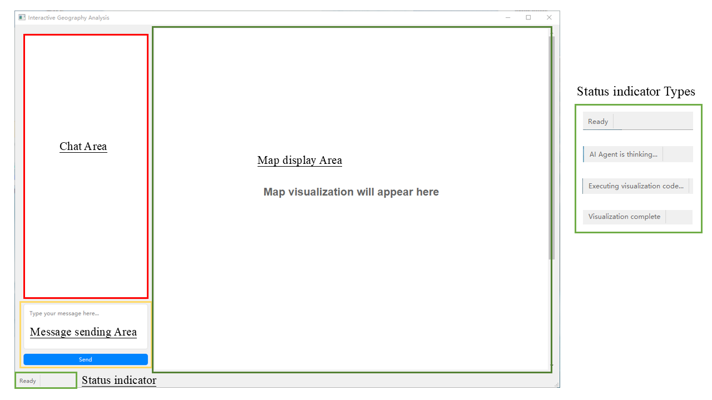
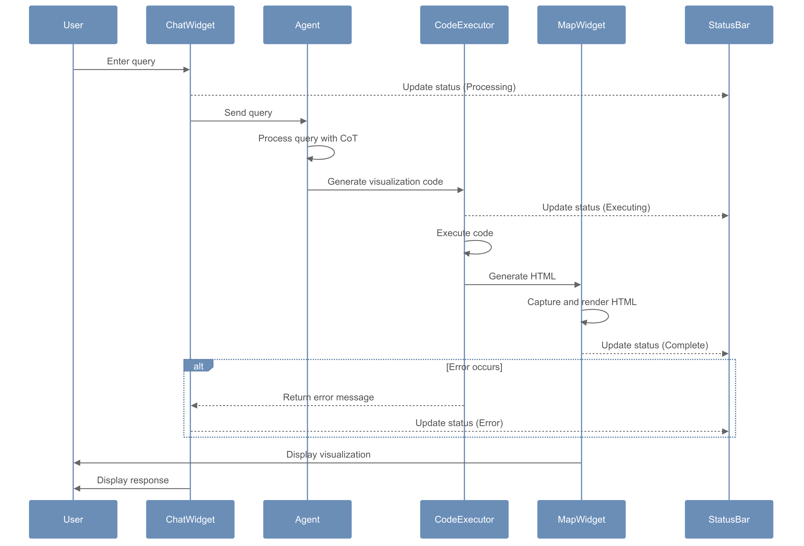

# Interactive Geographic Information Analysis System for Historical Venice

An AI-powered geographic information analysis system designed for exploring and visualizing historical Venetian data from the Venice Time Machine project. This system enables researchers to analyze complex historical geographic data through natural language interaction, generating sophisticated visualizations in real-time.

## 🎥 [Presentation Link](https://www.canva.com/design/DAGZq4b5cYA/IcEpZaGWo4mC5cSCmz2gyw/view?utm_content=DAGZq4b5cYA&utm_campaign=designshare&utm_medium=link2&utm_source=uniquelinks&utlId=hb224ef539c)


## 📋 Table of Contents
- [Key Features](#-key-features)
- [Installation Guide](#-installation-guide)
- [Project Structure](#-project-structure)
- [Dataset Overview](#-dataset-overview)
- [System Architecture](#-system-architecture)
- [AI Agent Design](#-ai-agent-design)
- [User Interface](#-user-interface)
- [Case Studies](#-case-studies)
- [Visualization Capabilities](#-visualization-capabilities)
- [Performance Analysis](#-performance-analysis)
- [Limitations & Future Work](#-limitations--future-work)

## 🌟 Key Features

- **Natural Language Interface**: Interact with historical data using conversational queries
- **AI-Driven Analysis**: Powered by Claude AI for intelligent data interpretation
- **Advanced Visualizations**: Multiple visualization types including 3D, heatmaps, and choropleth maps
- **Real-time Processing**: Generate visualizations in under 60 seconds
- **Interactive Map Display**: Dynamic map interactions with zoom, pan, and layer controls
- **Code Transparency**: View and modify generated visualization code in real-time


## 🚀 Installation Guide

### Prerequisites
- Python 3.8 or higher
- PyQt6
- Anthropic API key for Claude

### Installation Steps

1. Clone the repository:
```bash
git clone https://github.com/dhlab-class/fdh-2024-student-projects-yutaka-ziang-xin.git
cd FHD_project
```

2. Install dependencies:
```bash
pip install -r requirements.txt
```

3. Configure the API key:
   Create `config/config.json`:
```json
{
    "api_key": "your-api-key-here",
    "model": "claude-3-5-sonnet-latest"
}
```

4. Launch the application:
```bash
python -m src.main
```


## 🛠️ Project Structure
```
project_root/
│
├── config/ # Configuration and prompts
│ ├── config.json # API key and other configurations
│ └── prompts.json # System and other prompts
│
├── src/
│ ├── init.py
│ ├── main.py # Main program entry
│ ├── ui/ # User interface components
│ │ ├── init.py
│ │ ├── main_window.py # Main Window
│ │ ├── chat_panel.py # Chat Panel
│ │ ├── map_panel.py # Map Panel
│ │ └── code_dialog.py # Code Execution Dialog Box
│ │
│ ├── core/ # Core processing logic
│ │ ├── init.py
│ │ ├── chat_manager.py # Chat Manager
│ │ ├── code_executor.py # Code Executor
│ │ └── config_loader.py # Configuration loading
│ │
│ └── utils/ # Utility functions
│ ├── init.py
│ └── code_parser.py # Code parsing tools
│
├── requirements.txt
├── data/            # Historical datasets
└── map_output/      # Generated visualizations
```

## 📊 Dataset Overview

Our project utilizes historical datasets from the Venice Time Machine project, focusing on two crucial periods:

### 1740 Venice Dataset
- 16,153 building records
- Parish-based organization (69 parishes)
- Key attributes:
  - Building functions
  - Owner information
  - Parish affiliations
  - Rent prices
  - Tenant details

### 1808 Venice Dataset
- 19,244 building records
- District-based organization (6 major districts)
- Key attributes:
  - Building functions
  - Owner information
  - Building areas
  - District classifications

### Landmarks Dataset
- 188 total landmarks
  - 105 churches
  - 83 squares
- Complete geolocation data (EPSG:4326)

### Data Characteristics
- Building functions evolved from 34 types (1740) to 44 types (1808)
- Consistent geospatial referencing (EPSG:4326)
- Common attributes across periods include building functions, ownership, and location data


## 🏗 System Architecture



The system employs a modular architecture with the following key components:

### Data Flow
1. **Chat Manager**: Handles user interactions and maintains conversation context
2. **AI Agent**: Processes queries and generates visualization code
3. **Code Generator**: Ensures proper code formatting and compatibility
4. **Code Executor**: Manages code execution in shared Python environment
5. **Map Renderer**: Creates interactive visualizations using Folium/PyDeck
6. **UI Display**: Presents results while maintaining responsive interaction

### State Management
- Centralized state management system
- Synchronized data flow between components
- Efficient handling of complex geographical data

## 🤖 AI Agent Design



### Prompt Structure
- Comprehensive data awareness
- Dataset analysis information
- Building function categories
- Multilingual support (Italian/English)

### Chain-of-Thought Framework
1. Query Analysis & Requirement Identification
2. Visualization Method Selection
3. Computational Complexity Assessment
4. Optimized Code Generation

### Error Prevention
- Empirical testing-based mechanisms
- Edge case handling
- Pre-defined visualization templates
- Color scheme management

## 💻 User Interface


*Main user interface*


*Real-time code execution and debugging interface*

### Interface Components
- Split-panel design
- Color-coded chat bubbles
- Real-time status indicators
- Interactive map controls
- Code execution dialog

### Interaction Logic


## 📖 Case Studies

### Case Study 1: Multi-functional Buildings Analysis
This case study demonstrates the system's flexibility in visualization methods when analyzing multi-functional buildings in 1808 Venice. The system provides two different perspectives of the same data:


*3D Hexagonal visualization showing building density and functional distribution*


*Alternative polygon-based representation providing detailed spatial context*

The transition between these two visualization types maintains data accuracy while offering different analytical perspectives for researchers.

### Case Study 2: Historical Relocations Analysis
This case study showcases our iterative prompt optimization process in visualizing historical building relocations exceeding 1km between 1740 and 1808. The evolution of the visualization demonstrates our commitment to balancing analytical precision with visual clarity:


*Initial unoptimized visualization showing all 13,918 relocation paths, resulting in visual clutter*


*First optimization attempt using data sampling, which improved clarity but affected calculation accuracy*


*Final optimized visualization implementing a dual-track approach: maintaining complete data accuracy for calculations while presenting clear, uncluttered visualization using representative samples*

This progression illustrates how we refined our approach to handle complex spatial-temporal data while ensuring both analytical accuracy and visual effectiveness.

## 📊 Visualization Capabilities

### 1. Point-based Visualization


Features:
- Basic markers with popups
- Cluster markers for dense areas
- Graduated symbols
- Color-coded markers
- Interactive filters

### 2. Heatmap Visualization


Features:
- Traditional heatmaps
- Kernel density estimation
- Gradient density mapping
- Customizable color schemes
- Adjustable radius and intensity

### 3. 3D Visualization


Features:
- 3D columns for quantities
- Height-based data representation
- 3D density columns
- Interactive viewing angles

### 4. Line-based Visualization


Features:
- Connection lines
- Flow arrows
- Path trajectories
- Network connections

### 5. Area-based Visualization


Features:
- Buffer zones
- Polygon regions
- Choropleth maps
- Interactive boundaries

### Advanced Combinations
Multiple visualization techniques can be combined to create more comprehensive and insightful representations:


*Polylines & Buffer Zone Analysis*


*Temporal Analysis: Comparative Heatmap*


*Density Analysis: Heatmap & Color Coding*


*Temporal-Spatial Analysis*


*Enhanced Point Distribution*


*Hybrid Density Analysis: Point-based & Heatmap*


### Below are some potential questions generated by AI for your testing:

1. Point-based Visualization:
```

Dataset: 1740
- "Map all residential buildings in 1740, using different markers for different social classes."
- "Show all properties owned by nobles in 1740, with cluster markers for dense areas."

Dataset: 1808
- "Visualize properties with gardens in 1808, using custom garden icons as markers."
- "Map properties based on their rental value, using graduated circles."
```

2. Heatmap Visualization:
```
Dataset: 1740
- "Create a heatmap showing the density of noble residences in 1740."
- "Generate a kernel density map of high-value properties in 1740."

Dataset: 1808
- "Create a heatmap showing property value distribution in 1808."
- "Show the density of commercial properties in 1808 using a gradient heatmap."
```

3. 3D Visualization:
```
Dataset: 1808
- "Create 3D columns representing property values in 1808, with height corresponding to value."
- "Show rental values in 1808 using 3D visualization, colored by property type."

Dataset: 1740
- "Display property sizes in 1740 using 3D columns."
- "Create a 3D representation of building heights (levels) from 1740 data."
```

4. Line-based Visualization:
```
Dataset: Landmarks + 1740
- "Connect all churches to their nearest noble residences in 1740."
- "Show the network of religious buildings and their associated properties."

Dataset: 1740 + 1808
- "Draw connection lines between properties that maintained the same ownership from 1740 to 1808."
- "Create a network visualization of properties owned by the same noble family in 1740."
```

5. Area-based Visualization:
```
Dataset: 1740
- "Create a choropleth map showing the concentration of noble properties by district in 1740."
- "Show buffer zones around major churches using 1740 data."

Dataset: 1808
- "Generate a choropleth map of average property values by district in 1808."
- "Highlight areas with high concentrations of commercial properties in 1808."

Dataset: Landmarks
- "Create buffer zones around major landmarks to show their areas of influence."
```


## 📊 Performance Analysis

- **Visualization Success Rate**: >85%
- **Response Time**: <60 seconds
- **Data Processing Capability**: 29,177 buildings
- **Path Analysis**: 13,918 individual paths
- **Memory Management**: Optimized for large datasets

## ⚠️ Limitations & Future Work

### Current Limitations

1. **Manual Error Debugging**
   - Complex visualizations still require manual intervention for error correction
   - Debugging process can be time-consuming for intricate queries

2. **Rigid Dialogue Structure**
   - Current conversation flow lacks flexibility in handling context switches
   - Limited ability to modify visualization parameters through natural dialogue

3. **Suboptimal Color Combinations**

*Example of problematic color combinations in visualization output: overlapping similar colors reduce readability and visual distinction between different data categories. This visualization demonstrates how closely related hues can create confusion in data interpretation, particularly in areas with dense information.*

### Future Development

1. **Multi-role Agent System Implementation**
   - Developing specialized agents for different visualization tasks
   - Implementing collaborative problem-solving between agents

2. **Automated Debugging System**
   - Creating self-diagnostic capabilities
   - Implementing automatic error correction mechanisms

3. **Enhanced UI Features**
   - Developing more intuitive interaction patterns
   - Adding real-time visualization parameter adjustments

4. **Advanced Color Scheme Optimization**
   - Implementing intelligent color selection algorithms
   - Developing contrast checking mechanisms
   - Adding accessibility considerations for color-blind users
   - Creating predefined, tested color palettes for different visualization types

## 📝 License
MIT License

Copyright (c) 2024 [LLM-generated Visualization]

Permission is hereby granted, free of charge, to any person obtaining a copy
of this software and associated documentation files (the "Software"), to deal
in the Software without restriction, including without limitation the rights
to use, copy, modify, merge, publish, distribute, sublicense, and/or sell
copies of the Software, and to permit persons to whom the Software is
furnished to do so, subject to the following conditions:

The above copyright notice and this permission notice shall be included in all
copies or substantial portions of the Software.

THE SOFTWARE IS PROVIDED "AS IS", WITHOUT WARRANTY OF ANY KIND, EXPRESS OR
IMPLIED, INCLUDING BUT NOT LIMITED TO THE WARRANTIES OF MERCHANTABILITY,
FITNESS FOR A PARTICULAR PURPOSE AND NONINFRINGEMENT. IN NO EVENT SHALL THE
AUTHORS OR COPYRIGHT HOLDERS BE LIABLE FOR ANY CLAIM, DAMAGES OR OTHER
LIABILITY, WHETHER IN AN ACTION OF CONTRACT, TORT OR OTHERWISE, ARISING FROM,
OUT OF OR IN CONNECTION WITH THE SOFTWARE OR THE USE OR OTHER DEALINGS IN THE
SOFTWARE.

## 📧 Contact
xin.huang@epfl.ch
